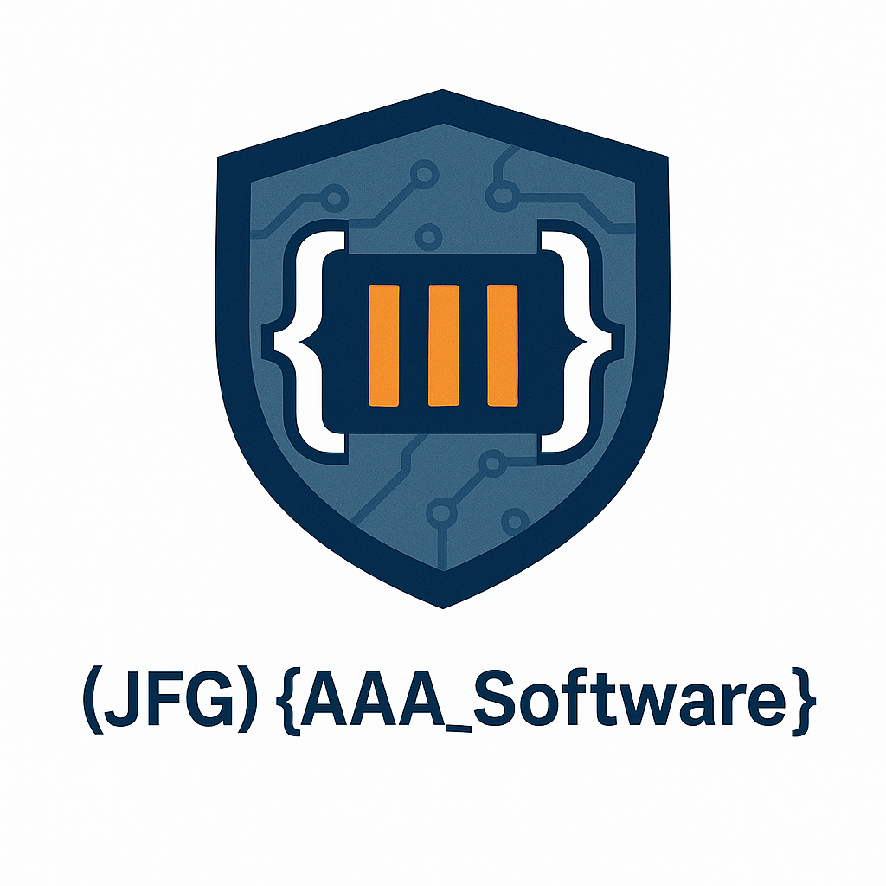

<strong>(JFG) {AAA_Software}</strong> 
<em>Desarrollo con propósito · Accesible · Actual · Ágil</em>

---

Insignias

# ¡Bienvenid@! a (JFG) {AAA_Software}

Mi nombre es José de Jesús Fuentes Galindo.

Soy ***Desarrollador Web Full Stack*** con experiencia en el diseño e implementación de aplicaciones orientadas a la automatización de procesos administrativos y al procesamiento estratégico de información.  
Mi enfoque combina el análisis de sistemas, el desarrollo de soluciones escalables y la documentación estructurada de procesos, contribuyendo a mejorar la eficiencia operativa y la toma de decisiones.

 

**📫 Contacto:**

---

## 🎯 Misión, Visión y Objetivos

**🧭 Misión**  
Diseñar y construir software de alto valor, con estándares de calidad AAA: Ágil en su desarrollo, Accesible en su uso, y Actual en su tecnología. Nuestro compromiso es generar soluciones digitales que dignifiquen al usuario final, resolviendo problemas reales con enfoque humano, ético y sostenible.

**🌍 Visión**  
Consolidar (JFG) {AAA_Software} como un referente en el desarrollo de software con impacto social y excelencia técnica. Aspiramos a crear herramientas que no solo funcionen bien, sino que transformen positivamente la vida de las personas y eleven los estándares del software con propósito.

**🎯 Objetivos estratégicos**

1. **Desarrollar productos con arquitectura sólida y enfoque iterativo**, garantizando resultados funcionales, escalables y sostenibles desde la primera entrega.
2. **Priorizar la experiencia del usuario en cada decisión de diseño**, asegurando que el acceso, la comprensión y la interacción sean simples, naturales y universales.
3. **Mantener una cultura de mejora continua**, integrando metodologías ágiles, automatización inteligente e innovación tecnológica para mantenernos siempre relevantes.
4. **Crear soluciones con impacto real y medible**, especialmente en áreas sociales clave como la alfabetización estratégica, la participación ciudadana y la educación digital.

---
## 🧩 Principios y Filosofía

En (JFG) {AAA_Software}, desarrollamos software con propósito. Nuestro compromiso es combinar excelencia técnica con impacto social, guiándonos por principios que aseguren que cada solución tenga valor real, ético y sostenible para la sociedad:

### 🧠 Ética tecnológica
Cada decisión técnica conlleva una responsabilidad humana. Aplicamos principios éticos en el diseño, implementación y mantenimiento de nuestras soluciones, priorizando la privacidad, la transparencia y el respeto por las personas.

### 📚 Alfabetización estratégica
Creemos que el conocimiento empodera. Promovemos la alfabetización como un proceso continuo y multidisciplinario, que incluye desde habilidades digitales hasta la comprensión del entorno legal, económico, político y tecnológico. Nuestro software busca habilitar ciudadanías más informadas, críticas y activas.

### 🌍 Valor social como eje de diseño
Desarrollamos tecnología que responde a necesidades reales, no solo a tendencias del mercado. Buscamos generar impacto positivo en comunidades, organizaciones y personas, contribuyendo a reducir brechas de información, acceso y participación.

### 🌐 Acceso universal
Diseñamos con un enfoque inclusivo, accesible desde cualquier dispositivo y útil para todo tipo de usuario, independientemente de sus condiciones técnicas, sociales o culturales. La accesibilidad no es opcional: es parte integral de la calidad.

### 🛡️ Soberanía tecnológica
Impulsamos el desarrollo autónomo y consciente de tecnología, favoreciendo el uso de software libre, estándares abiertos y control ético sobre los datos. Fomentamos ecosistemas locales sostenibles y resilientes.

### 🫱 Diseño centrado en la dignidad
Más allá de la experiencia del usuario, diseñamos considerando el contexto social, emocional y cultural de las personas. La tecnología no debe vulnerar, invisibilizar ni excluir.

### 🔁 Automatización con criterio
Automatizamos procesos para liberar el potencial humano, no para sustituirlo irresponsablemente. Aplicamos automatización donde aporta eficiencia sin comprometer la integridad de las decisiones o relaciones humanas.

### 🔄 Iteración con propósito
Adoptamos prácticas ágiles no solo por productividad, sino para asegurar una mejora continua basada en el feedback real de las personas a quienes servimos. Escuchar, aprender y adaptar es parte de nuestro ADN.

### 🤝 Transparencia y confianza
Creamos entornos colaborativos y abiertos. Compartimos lo que hacemos y cómo lo hacemos, documentamos con claridad y fomentamos el diálogo con usuarios, aliados y comunidades técnicas.

---

## 🚀 Proyectos destacados

🔹 [Sistema de Gestión Escolar](https://github.com/JesusFuentesGalindo/sge-aaas): Plataforma web para control académico y administrativo con enfoque accesible. Stack: Laravel, Alpine.js, Tailwind CSS, MySQL.

🔹 [AlfaCiudadana](https://github.com/JesusFuentesGalindo/alfaciudadana): Aplicación de alfabetización estratégica para ciudadanía digital crítica. PWA basada en Codeigniter, Figma, y PostgreSQL.

🔹 [AutomatizaDoc](https://github.com/JesusFuentesGalindo/automatizadoc): Herramienta para automatizar flujos de documentación administrativa. Interfaz intuitiva + integración con JSON y Web Semántica.

🔹 [OpenForm Builder](https://github.com/JesusFuentesGalindo/openform-builder): Generador accesible de formularios adaptables, sin necesidad de escribir código. Desarrollado con JavaScript puro y Tailwind CSS.

---

## 📈 Estadísticas

  <!-- GitHub Stats -->
  

  <!-- Lenguajes más usados -->
  

 

  <!-- GitHub Streak -->
  

